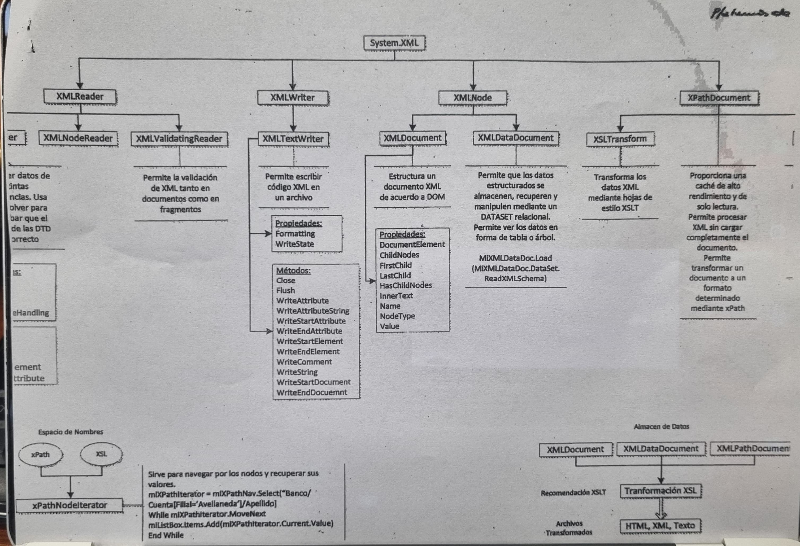
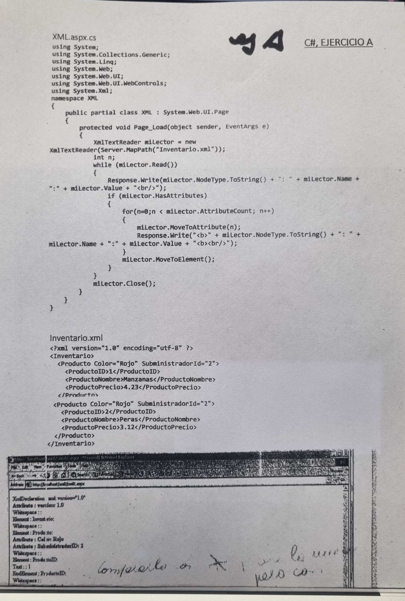

# Clase 10

Diapositivas de la presentación que van en el parcial (clase 9): 
5 6 9 12 13 20 21 25 27 28 45 46 55 65 66 67 74 75 76 78 84 85 93 94 95 127 133

> [!WARNING]
> El 2do parcial es el 23

El parcial tiene 10 preguntas. 

El tp se puede entregar en las fechas 30, 7 y 14.

## Preguntas de parcial

1. Cuales son las 3 b?
2. Cómo son la relaciones entre ias pas y otra mas q no recuerdo.

## Tp 5

## Modelo de objetos de XML .NET

Hcer el ejercicio A

Para la clase q viene queda como armar un archivo xml con código
