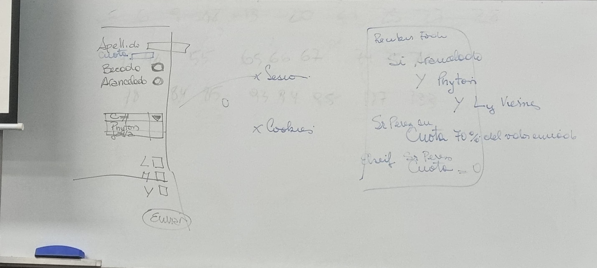

Diapositivas de la presentación de la clase 9 5 6 9 12 13 20 21 25 27 28 45 46 55 65 66 67 74 75 76 78 84 85 93 94 95 127 133

2do parcial el 23

10 preguntas tiene el parcial

El tp se puede entregar el 30 7 y 14

Cuales son las 3 b

como son la relaciob entre ias pas y otra mas q no recuerdo

# Tp 5

