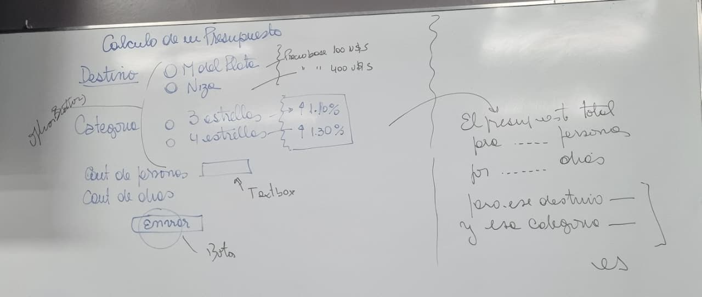

# Clase 5

## Ejercicio durante la clase

Cálculo de un presupuesto de viajes.

[Ir al código]()

Contro: Dáas que no sea mayor a 15 y que estes obligado a ponerlo.

## Preguntas durante la clase

## Parcial

Temas importantes:

- Como es un anclaje local y un externo
- Ciclo de vida de un ASP primitivo

html
head
    script
        funcion clacular y un submit
    /script
/head

body
    form
        funcion calcuar instnciada en script
    /form
/body

/html

servidor: recepcion de lo que viene del cliente a traves del submit + lógica + envio de datos al cliente

expires es el metodo que me dice que una cookie no es persistente?
expires no es un metodo, es una propiedad.

Para que me sirve una variable de sesion?

Modelo de objetos, cuales son los objetos: request response, server, application

De cada objero grafique el modelo de objetos: EJ OBJETO SERVER: CreateObjet

Global.asax es un archivo de configuración pero esta intimiamente ligado a .net, por que y en donde?

otros archivos de config:
web config
machine config

Cuales son los eventos en el objeto sesion y application? onstart y onend

para que me sirve la propiedad haskeys? es booleana si es verdadera estas dentro de un diccionario de cookies

recorrer la colexión de cookies.
que es una coleccion comun o un diccionario de cookies?

Como identifico un archivo html o aspx
cuando en el codigo veo response o request es un aspx

el cliente que recive? HTML

## TP

1er entrega: Casos de uso, login y bitacora.
Carpeta:
    Solapas: 
        interfaz de usuario
            Ide de desarrollo con las clases
            aspx de la interfaz de usuario
            codigo
            Solo el codigo de login que lo autentica, quiere el diagrama ese que no me acuerdo como se llama, de secuencia? No quiere un diagrama exacto de secuencia. es mas conceptual, con el fragmento de código dentro.
        Acceso a datos
        Capa de negocios
        Caoa de entidades

Necesita que en el TP haya un regular expression validation

   > [!NOTE]
   > No subí el ejercicio al repo porque la pc de la facu no tenía internet.
