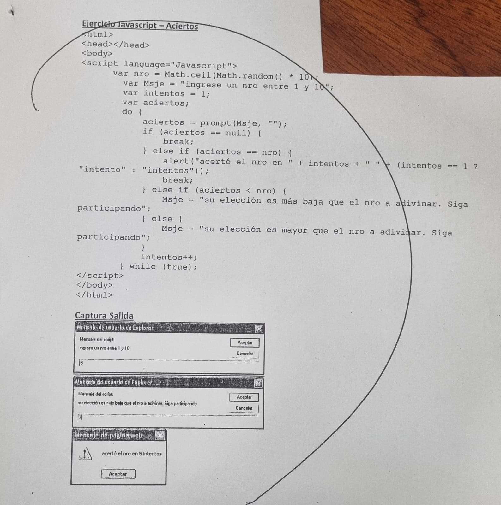
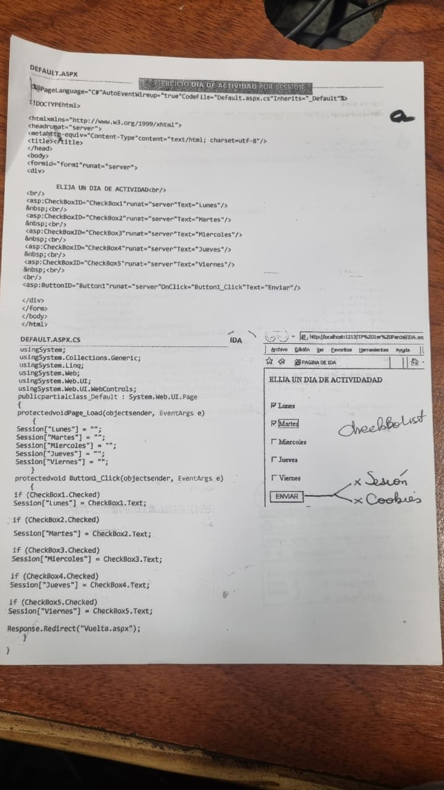
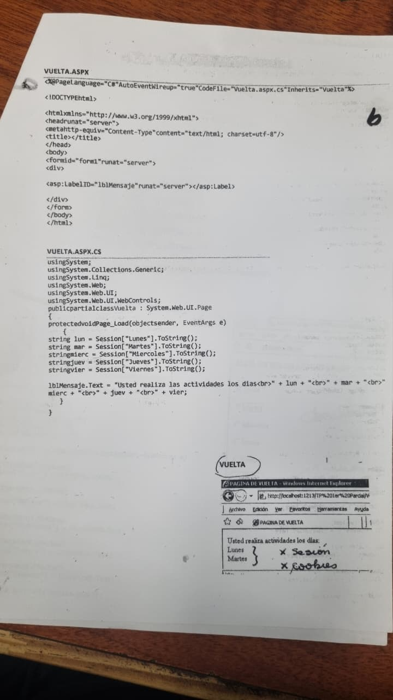

# Clase 7

## Controles nuevos

Checkbox --> Va para el parcial 2

## "TP 1"

Juntar los ejercicios que vimos en clase en un word, mandarle el pdf al profe x correo

## Entrega 1 del TP

Que se logeen con distintos perfiles --> Tiene que aparecer un cartel que diga "se logeo usuario rol"

Tiene que estar el ciclo de vida de autenticación.

El profe nos manda las diapos q vimos en la clase

## Diapos importantes para el 2do parcial

- 1ra: Seguridad de la web
  - Caracts
  - Medidas
- 2da: Los 4 renglones de arriba no importan
  - medidas de seguridad de caracter tecnico si
  - No repudio = yo no puedo negar lo que mandé
    - Cual sería la herramienta técnica para el no repudio? la firma digital
- 3ra Importa los mecanismos de protección
- 4ta: el cuadrado de arriba no va, solo el de abajo, niveles de seguridad clasico
- 5ta: Le interesa que significa MAC, DAC, RBAC
  - RBAC tiene relacion con usuario familia paptente, composite, roles aplicados en diploma
- 6ta: nombre 3 mecanismos de seguridad relacionados con el control de acceso.
- 7ma: no va, nada
- 8va: no va, nada
- 9na: entera. Modelo de Mc Call + caracts principales (los items)  
  - Nombre 4 caracts del modelo de calidad de Mc Call
- 10ma: solo lo que esta dentro del cuadrado superior
- 11va: No va
- 12va: El cuadro de Usabilidad si. el cuadro de calidad de la web no
  - Defina la usabilidad, capacidad de un soft de ser aprendido comprendido usado y atractivo para su uso
- 13va: no va
- 14va: Los atributos de Nielsen
- 15: no va
- 16: modelo de calidad WQM
  - Alguna parta de absisas y z ven algo que les resulte familiar? los principios de Mc Call
- 17: no va
- 18: no va
- 19: Clasificacón de las metricas y nombrar 1 par
  - Automatización
  - Correspondencia
- 20: Elegir 1 de cada 1
  - Efectividad
  - Productividad
  - Seguridad
  - Satisfacción
- 21: Cual es la dif concreta entre usabilidad y accesibilidad? la accesibilidad depende con los problemas cognitivios, físicos... y la usabilidad con los colores, posición de botones.
- 22: no
- 23: no

## Ejercicio 1 del TP2

Entra en el 2do parcial

[Ir al código](https://github.com/lautaro-rojas/Desarrollo-y-arquitecturas-web/blob/main/Clase%207/EjercicioClase7/index.html)



```HTML
<html>
<h1>Ejercicio clase 7 + JS</h1>
<head>
<script lang="Javascript">
    var nro = Math.ceil(Math.random() * 10);
    var Msje = "Ingrese eun nro entre 1 y 10";
    var intentos = 1;
    var aciertos;
    do {
        aciertos = prompt(Msje, "");
        if (aciertos == null) {
            break;
        } else if (aciertos == nro) {
            alert("Felicitaciones, adivinaste el nro " + nro + " en " + intentos + " intentos");
        } else if (aciertos < nro) {
            Msje = "El nro es mayor, intente nuevamente";
        } else {
            Msje = "El nro es menor, intente nuevamente";
        }
        intentos++;
    } while (true);
    </script>
</head>

</html>  
```

## Ejercicio 2 del TP2




