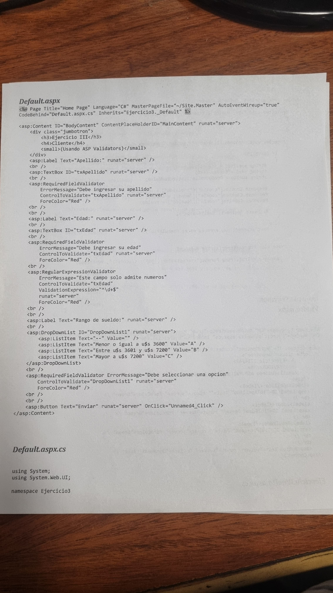
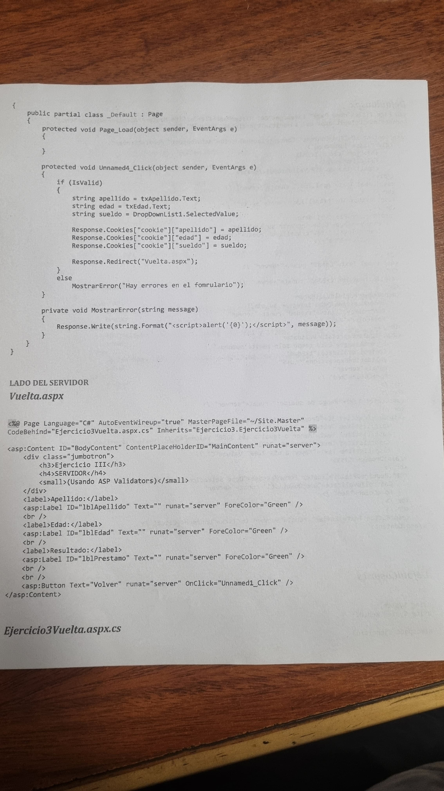

# Clase 8

- Primer entrga de TP grupal
- Cookies

## En la 2da entrega del TP

- Carrito de compras elemental (básico)
- Actualizar la parte de seguridad (tomamos nota)
  - Loguear como Admin -> hacer un backup -> salir del sistema -> romper 2 tablas (por lo menos en 2 tablas tiene que haber dígito verificador) -> loguear como admin -> cartel "error de integridad y que tabla/s y registro/s están corruptos".
  - Cosas de las contraseña

    - Contraseña 8 caracteres letras may y min y caracter especial
    - Bloquear el usuario desp del 3er intento incorrecto o hacer algo

Entrega -> 4 clases antes de la ultima

## TP nro 2

Se necesita mandar al servidor los días seleccionados para distintas actividades. Tanto por sesión como por cookies. (no usé cookies)

## TP nro 3

Calcular la edad en meses x sesión y por cookies.
Dado los 2 catetos caular permimtro area e hipotenusa de un triangulo.

## TP nro 4

Nos dio una fotocopia

Se pide un préstamo a una financiera. La indo enviada es:

- Edad
- Apellido
- Rango de sueldo

La lógica estará en el servidor:

- Si la persona tiene -23 o +75 no se le otorga préstamo.
  - Si esta dentro de rango dependerá del sueldo

Se tiene que trabajar por sesión y por Cookies. Incluye DropDownList con cookies.

## Machete de Cookies

