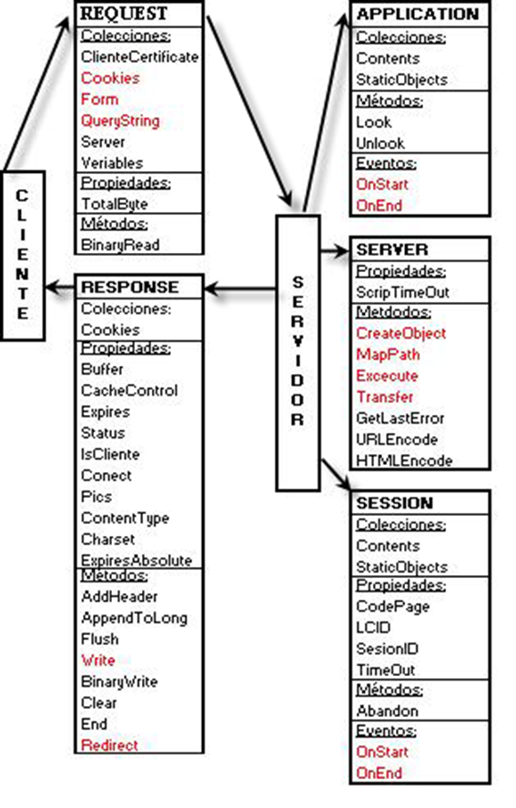
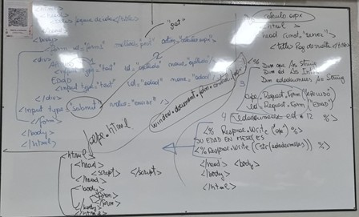
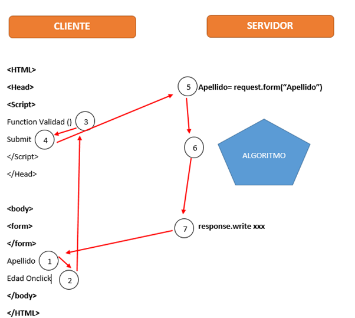

# Resumen teórico

## Qué estructura tiene una página html a grandes rasgos?

```html
<html>
    <head>
        <script>
        </script>
    </head>
    <body>
        <form>
        </form>
    </body>
</html>
```

## Basado en esta porción de código, qué tipo de archivo es?

La respuesta que se busca con esta pregunta es definir la parte de cliente vs servidor. Si se ve "Request.Form(xx)", o "Response.Write(xx)" estamos hablando del servidor

## Compare estructura archivo html4 vs html5

html5 permite embeber contenido multimedia con tags `\<audio>` y `\<video>`.

html4 solo declara divs, mientras que html5 permite utilizar ciertos tags específicos como `header`, `footer`, `nav`, `main`.

## Cuáles son los objetos de ASP.NET

- Request
- Response
- Session
  - tiene los eventos en on start on event
- Aplication
  - tiene los eventos en on start on event
- Server
  - .create object

## Cómo sabe el sistema, que cuando enviamos, a donde estamos enviando la información?

Dentro del form, con la propiedad action, especificamos a donde estamos mandando la información y con el method, décimos si fue con GET/ POST, etc.

Con el submit, declaramos la accionable (botón) que al aplicarse nos llevará hacia el servidor.

## Diagrame el modelo de objetos de ASP.NET (no lo entiendo)

El profe pide que diagramemos todos pero que rellenemos un parámetro mínimo de c/u, algo fácil de memorizar por ejemplo
2 actores, cliente, servidor.

Cliente genera un request -> request es uno de los objetos. Este contiene cookies, pero obviamente lo podemos relacionar también con Form (métodos POST) y QueryString (métodos GET).

Esto lo recibe un servidor, el segundo actor. Para procesar dicho request, hace uso de 3 objetos, Session quien se encarga de persistir datos relevantes a la sesión de usuario (necesario ya que HTTP es stateless), este tiene eventos OnStart y OnEnd, que comparte con el objeto Application. Por último, el servidor en sí también es un objeto, Server, que tiene la propiedad de timeout.

El servidor en respuesta, envía el objeto response. Este podemos ver que tiene las cookies como colección, ya que seguramente algo haya modificado, o también las propiedades como flush, end, write, redirect, clear



## Qué es el Global.asax

Es un archivo de configuración donde se declaran variables de sesión y de aplicación independientes de cualquier pagina.

## Los eventos OnStart OnEnd, a qué están relacionados?

Al archivo de configuración `Global.asax`.

## Qué 3 archivos de configuración son fundamentales?

`Global.asax`, `Machine.config`, `Web.config`

## Criterios de evaluación de una página web

1. Es razonable el tiempo de carga de la página?
2. Existe coherencia en la disposición de las páginas?
    - Color de las fuentes tipográficas
    - Imágenes del sitio
3. Se reconoce facilmente el propósito del sitio?
4. El contendio está ordenado lógicamente?
5. para un objetivo determinado existen enlaces alternativos?
    Ejemplo: Opcion de hacer backup en varios puntos de la página
6. Avanzo y retrocedo facimente en los distintos niveles?
7. Pueden los usuarios encontrar la info deseada con un nro mínimo de 3 cliks?

## Qué define la navegación interna en la página, y hacia otro servidor?

```html
<a href="#MARCA"> Mediante un enlace local </a>
<a href="https://enlace"> Mediante un enlace externo </a>
```

## Cómo se define una lista ordenada?

```html
<!-- Numerada = Ordenada -->
<ol>
<li>Sistemas</li>
<li>Ingeniería</li>
<li>Derecho</li>
</ol>
```

## Cómo se define una lista desordenada?

```html
<ul>
<li>Coffee</li>
<li>Tea</li>
<li>Milk</li>
</ul>
```

## Cómo se genera un cuestionario?

```html
<body>
    <h1>Cuestionario de Conocimientos</h1>
    <!-- El atributo action indica a dónde se enviarán los datos -->
    <!-- method="post" envía los datos de forma segura -->
    <form action="" method="post">
    <select name="Emisoras">
    <option value="1">Aspen</option>
    <option value="2">La100</option>
    <option value="3">Mitre</option>
    </select>
    </form>
</body>

Explicación rápida:

<form>: Contenedor del cuestionario.
action: URL o archivo que procesará las respuestas (puede ser PHP, Python, etc.).
method="post": Envía los datos de forma más segura que get.
<fieldset> y <legend>: Agrupan y titulan cada pregunta.
<input type="radio">: Opción única por pregunta.
<input type="checkbox">: Permite seleccionar varias opciones.
<input type="number">: Campo numérico.
required: Obliga a responder antes de enviar.

```

## ¿Cuál es el problema de estado en ASP.NET?

La naturaleza asíncrona de ASP no permite persistir los valores cuando se pasa de una página a otra, Esto se debe a que ASP está basada en HTTP(protocolo de estado). Esto se soluciona mediante el uso de cookies, variables de sesion y variables de aplicación.

## Ciclo de vida de un ASP primitivo?

El cliente genera un request a través del envío de un formulario o un GET. El servidor recibe el request, lo procesa utilizando los métodos declarados y devuelve la información en forma de Response, para que el cliente reciba la información que es el HTML ya armado.



1. Declara campos (o datos)
2. Submit de los datos
3. Recupero los datos
4. Hago algoritmos
5. Encargado de mandar el resultado del cliente



## ¿El browser que recibe?

Solo entiende html.

## En la jerarquía de objetos (web), que objeto representa

- Browser --> Window
- página --> Document
- Formulario --> Front
- Control --> Control (representativo al que se esté usando)
- Prop: Propiedad del control

Ejemplo:
window.document.form.control.prop

## Qué es una colección o diccionario de cookies?

Un diccionario de cookie es una estructura de información que contiene datos de las cookies de sesión utilizadas por el usuario bajo un acuerdo de llave valor para poder diferenciarlas.

Un diccionario de cookies se desarrolla de la siguiente forma:

```CSharp
Response.Cookies("Usuario")("Nombre")  = "June Thomas"
Response.Cookies("Usuario")("UltimaVisita") = Now()
Response.Cookies("Usuario")("CodigoPostal") = "72301"
Response.Cookies("Usuario").Expires = "12/31/2000 14:00"
```

## Cómo se recorre un diccionario de cookies?

Con un for each, pero el profe acá lo que quiere ver es que nosotros le digamos
`if Request.cookies("x").HasKeys` y ahí entremos en el foreach. Esta parte del haskeys es crucial para saber si es un diccionario de cookies o una cookie simple (solo 1 llave valor).

## Cómo se lee una cookie?

`Request.Cookies("valor")` o `Request.Cookies("valor")("10")` para compuestas.

## Cómo se asignan las cookies?

`Response.Cookies("Color")` para simples, `Request.("Color")("Texto")` para cookies tipo diccionario

## Cómo setteamos la expiración de una cookie?

Respone.Cookies("ColorPreferido").Expires = fecha

## Para qué sirve la propiedad HasKeys?

Para saber si el elemento en cuestión es una colección de cookies. En ese caso el método devuelve true

## Para qué sirve una variable de sesión?

Para poder persistir datos de navegación a través del paso de páginas. Resuelve el problema de estado de ASP.NET

## Qué es CORBA?

Common Object Request Broker Architecture, estándar que permite que diversos componentes de software escritos en diferentes lenguajes de programación, que corren en distintas computadoras, puedan trabajar juntos.

Dentro de este modelo se describen varios objetos que trabajan con esta finalidad. Cliente, quien suele ser la cara visible se comunica con el ORB (object request broker) quien acciona un IDL (interface description language) para comunicarse con el servidor, quien está implementado en otro lenguaje, devuelve una response al request. Hay un broker que se llama visibroker orbix que funciona para mappear en distintos lenguajes.

## Qué es el DOM?

Es una interfaz de programación que representa documentos HTML y XML como una estructura de árbol jerárquica.

## \#PCDATA VS \#CDATA

Son términos utilizados en XML/HTML para definir que un elemento contiene texto que será analizado por un procesador. Significa que el analizador buscará etiquetas o entidades especiales (como &amp;) dentro del texto, a diferencia de CDATA que no se analiza.

## ¿Cuál es la diferencia entre un sistema cliente/servidor y un sistema distribuido?

En un sistema cliente/servidor, se entiende entre los dos y se comunican. En el sistema distribuido no hay una comunicación directa. La misma se realiza por medio de un broker. (con esta respuesta alcanza)

## ¿Qué es una cookie?

Las cookies son pequeños archivos de texto que se utilizan para recordar el inició de sesión y preferencias del usuario.

## ¿Se pueden clasificar las cookies?

- Tamaño
  - Diccionario
  - Comunes
- Persistencia
  - Si tiene .Expires = "fecha” se vence esa fecha
  - Sesión, expira cuando el usuario cierra la sesión

## Diferencias entre GET y POST

- GET: Muestra la información en la url
- POSTM Muestra la información en el payload. Es decir, va a estar algo protegida

## Si mando Post ¿Con que recupero la información? ¿Si mando con Get con que recupero la información?

Si envió por [POST] recibo por ?[REQUEST.FORM] –Si envio por [GET] recibo por [REQUEST.QUERYSTREAM]

## ¿Cuál es el método de este objeto que permite incorporar un componente en mi página? ¿Cómo lo hace?

Server.CreateObject. Es el objeto que me permite crear una instancia de un componente de servidor.

## Cómo llamo a una Subrutina .js en batch y como la llamo desde un .Asp?

Desde ASP se llama a un script presente dentro del código para esto se utiliza: `onclick=”javascript:validar()”`.

En cambio para llamar a un script externo(archivo.js) se debe llamar a la fuente `<script type=”text/javascript” src=”script.js”></script>`.

## Explique todo acerca de la palabra reservada #PCDATA

Son datos de caracteres analizados sintácticamente. Los elementos también pueden contener datos de caracteres no analizados(#CDATA) o simplemente, elementos secundarios.

## Explique todo acerca de la palabra reservada #CDATA

Es una sección de datos que contiene información que no se quiere analizar sintácticamente, como datos de caracteres XML. 