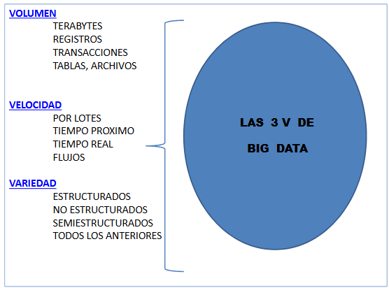
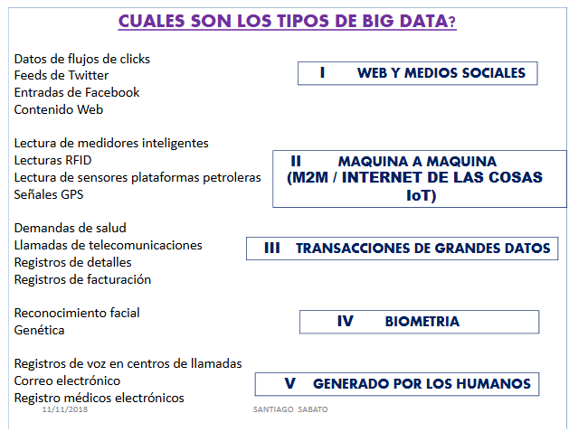
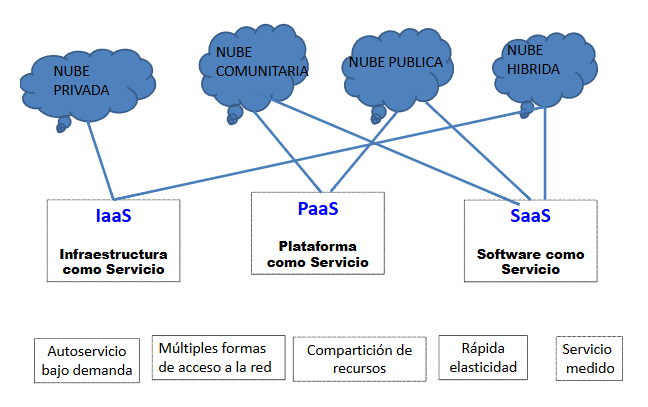

# Diapositivas clase 9
 
5 6 9 12 13 20 21 25 27 28 45 46 55 65 66 67 74 75 76 78 84 85 93 94 95 127 133

## 5
Defnición de científico de datos

ES UNA PERSONA CON HABILIDADES EN CIENCIAS DE LA COMPUTACION, ANALISIS, MATEMATICAS, ANALISIS FUNCIONAL, ANALISIS MATRICIAL, GENERACION DE MODELOS Y ESTADISITICAS.

DEBE SER ADEMAS UN BUEN COMUNICADOR CAPAZ DE ENTENDER UN PROBLEMA DE NEGOCIOS, TRANSFORMAR ESE PROBLEMA EN UN PLANO ANALITICO, EJECUTAR EL PLAN Y LUEGO DAR UNA SOLUCION DE NEGOCIOS.

## 6
COMO ES LA ARQUITECTURA DE BIG DATA?

FUENTES DE BIG DATA: LOS DATOS PROCEDEN DE LA WEB, DE LOS SOCIAL MEDIA, DE INTERCONEXION DE OBJETOS M2M (CHIPS NFC, RFID..) DE SENSORES CONOCIDOS COMO EL INTERNET DE LAS COSAS, DE LA MOVILIDAD, BIOMETRIA, DATOS PROCEDENTES DE LAS PROPIAS PERSONAS, ETC.
- TIPOS DE DATOS: SE CLASIFICAN EN TRES GRANDES CATEGORIAS: 
  - ESTRUCTURADOS (DATOS TRADICIONALES DE LAS BASES DE DATOS RELACIONALES)
  - NO ESTRUCTURADOS (AUDIO, VIDEO, FOTOGRAFIA, TEXTOS....)
  - SEMIESTRUCTURADOS(ARCHIVOS HTML, XML..)
  - ALMACENES DE DATOS EMPRESARIALES (EDW, ENTERPRISE DATA WAREHOUSE)

## 9
Las 3 V de Big Data:
1. Volumen
   - TERABYTES
   - REGISTROS
   - TRANSACCIONES
   - TABLAS, ARCHIVOS
2. Velocidad
   - POR LOTES
   - TIEMPO PROXIMO
   - TIEMPO REAL
   - FLUJOS
3. Variedad
   - ESTRUCTURADOS
   - NO ESTRUCTURADOS
   - SEMIESTRUCTURADOS
   - TODOS LOS ANTERIORES

## 12
CUALES SON LAS FUENTES DE DATOS MAS VOLUMINOSAS?

- Datos de la Web
- Datos de los medios sociales
- Datos de Internet de las Cosas.
- Datos de interconexión entre maquinas, M2M (machine to machine)
- Datos industriales de organizaciones y empresas (de múltiples sectores)
- Datos de la industria del automóvil
- Datos de redes de telecomunicaciones
- Datos de medios de comunicación (prensa, radio, televisión, cine...)
- Datos procedentes de sensores en los mas diferentes campos de la industria y de la agricultura.
- Datos de videojuegos, casinos..etc
- Datos de telemetría y geolocalización
- Datos procedentes de chips NFC, RFID, códigos QR Bidi, en aplicaciones decomercio electrónico.
- Datos procedentes de servicios de telefonía móvil(celulares) inteligente: texto, datos, audio, video, fotografía.
- Datos procedentes de redes inteligentes smartgrids.
- Datos personales, datos de texto.

## 13 
Cuales son los tipos de Big Data?

1. Web y medios sociales 
   - Contenido web en general
2. Máquina a máquina e IoT
   - Lectura de medidores inteligentes
   - Lecturas RFID
   - Lectura de sensores plataformas petroleras
   - Señales GPS
3. Transacciones de grandes datos
   - Demandas de salud
   - Registros de facturación
4. Biometría
   - Reconocimiento facial
5. Generado por los humanos
   - Registros de voz
   - Correo electrónico

## 20
IMPORTANCIA DE LOS DATOS TOMADOS DE LA WEB

LA ANALITICA DE LA WEB HA ALCANZADO TANTA IMPORTANCIA DEBIDOA QUE ESTUDIA EL TRAFICO EN EL SITIO WEB Y PROPORCIONA METRICAS E INDICADORES CLAVE DE RENDIMIENTO O DESEMPEÑO (KPI) QUE SON DE UN VALOR AÑADIDO MUY NOTABLE EN EL PROCESO DE TOMA DE DECISIONES.

ALGUNAS AREAS PARA HACER UN BUEN ANALISIS DE BIG DATA SON: Compras en comercios electrónicos

Preguntas de interés libre al inicio de la navegación
- Que buscador?
- Que términos de búsqueda se introducen?
- Que etiquetas?
- Vienen de enlaces gratuitos recomendados o de publicidad (SEM)?
- Cuales son los productos que examina?

Caminos y preferencias de compras ayudan a averiguar sus preferencias (categorías de artículos, de pasajes de avión..etc.)

## 21
MPORTANCIA DE LOS DATOS DE TEXTO

UNA DE LAS FUENTES DE DATOS MAS COMUNES Y MAS GRANDES DE LOS BIG DATA ESTAN EN LOS CORREOS, MENSAJES DE TEXTO, TUITS, BLOGS, WIKIS, SMS, WHATSAPP.

LA ANALITICA DE TEXTOS SE ENMARCA DENTRO DE DISCIPLINAS COMO EL PROCESAMIENTO DE LENGUAJE NATURAL Y LA NUMERACION DE TEXTOS DENTRO DE OTRAS DISCIPLINAS COMO INTELIGENCIA ARTIFICIAL Y LINGÜÍSTICA COMPUTACIONAL.

EL ANALISIS DE TEXTO COMIENZA CON SU ANALISIS SINTACTICO (PARSING) Y LA ASIGNACION DE SIGNIFICADOS A LAS  DISTINTAS PALABRAS, FRASES Y DEMAS COMPONENTES QUE INTEGRAN UN TEXTO. COMO HERRAMIENTAS, ENTRE OTRAS ESTA LA MINERIA DE DATOS. 

LA MINERIA DE TEXTOS ES EL PROCESO DE DEDUCIR INFORMACION DE ALTA CALIDAD A PARTIR DE UN TEXTO DETERMINADO.

## 25
DATOS DE SENSORES

LOS SENSORES SON UNA PIEZA CLAVE EN INTERNET DE LAS COSAS O DE LOS OBJETOS.

EL AVANCE DE LA MINIATURIZACION, NANOTECNOLOGIA, REDES INALAMBRICAS Y TELEFONIA MOVIL ESTAN IMPULSANDO EL DESARROLLO  DE SENSORES CAPACES DE MONITOREAR EL ENTORNO EN FORMA UBICUA Y AUTONOMA, CREANDO LOS DENOMINADOS ENTORNOS O AMBIENTES INTELIGENTES.

LAS REDES DE SENSORES CONSTAN DE MULTIPLES SENSORES INALAMBRICOS DISTRIBUIDOS EN UN ESPACIO GEOGRAFICO COMO UNA CIUDAD, UN EDIFICIO, UN PARQUE NATURAL, MAQUINARIA INDUSTRIAL..ETC.

EN LOS ULTIMOS AÑOS LOS SENSORES SE HAN EMBEBIDO O INCRUSTADO EN DISPOSITIVOS, MAQUINAS, SISTEMAS Y SE UTILIZAN EN TODO TIPO DE MOTORES DE AVION, DE BARCOS, TRENES, AUTOS PUDIENDOSE MONITOREAR EL ESTADO DEL EQUIPO EN TIEMPO REAL.

## 27
DATOS DE POSICION Y TIEMPO: GEOLOCALIZACIONSE LA INFORMACION DE POSICION GEOGRAFICA Y TIEMPO DEBIDO A LOS TELEFONOS CELULARES INTELIGENTES ADEMAS DE LOS ELEMENTOS DE POSICIONAMIENTO GLOBAL Y DISPOSITIVOS PERSONALES GPS SON UNA FUENTE DE DATOS MUY IMPORTANTES.

EL BINOMIO TIEMPO Y POSICION SE PUEDE APLICAR EN UN SINNUMERO DE ACTIVIDADES, SOBRE TODO EN LOGISTICA. EXISTEN APLICACIONES DONDE LAS COORDENADAS SE ENVIAN A UN SERVIDOR EXTERNO QUE ALMACENA SUS DATOS Y PUEDEN SER VISUALIZADOSPOR LOS CONTACTOS AUTORIZADOS. SON POSIBLES LAS SIGUIENTES FUNCIONALIDADES:
- Ver localización actual de contactos
- Ver la ruta monitoreada de contactos de hoy, ayer (y datos históricos más antiguos)
- Ver la ruta monitoreada del usuario en tiempo real
- Enviar mensajes a contactos
- Recibir notificaciones de contactos cercanos

## 28
DATOS DE RFID Y NFC

SON LAS TECNOLOGIAS DE IDENTIFICACION POR RADIOFRECUENCIA.

UNA ETIQUETA RFID (TAG) ES UNA PEQUEÑA ETIQUETA SITUADA EN OBJETOS, TALES COMO; ALIMENTOS, ROPA, MEDICAMENTOS, LIBROS, CARTAS , ARTICULOS..ETC.

CUANDO UN LECTOR RFID ENVIA UNA SEÑAL, LA ETIQUETA RFID RESPONDE RETORNANDO INFORMACION; ES POSIBLE TENER MUCHAS ETIQUETAS QUE RESPONDEN A UNA CONSULTA SIEMPRE QUE ESTE EN EL RANGO DEL LECTOR. RFID SE PUEDE APLICAR A;
- Etiquetado de productos y mercancías
- Control de calidad
- Logística, control de stocks
- Localización y seguimiento de objetos
- Seguridad, identificación y control de accesos
- Pagos
- Detección de falsificaciones
- Seguimiento de paquetes en mensajería (courier)
- Automación de los procesos de fabricación
- Inventario automático
- Control de robos

## 45
MEDIANTE CIENCIA DE LOS DATOS SE PUEDE HACER:
- RECOMENDACIÓN DE PRODUCTOS, EXPERIENCIA DEL USUARIO (AMAZON)
- RECOMENDACIÓN DE PERSONAS QUE PODRIAS CONOCER (FACEBOOK)
- SISTEMA DE RECOMENDACIONES Y CONOCIMIENTOS PERSONALES (LINKEDIN)
- ANALISIS Y MEJORA DE PROCESOS DE DISTRIBUCION (WALMART)
- ANALISIS DEL TIPO DE CONSUMIDOR QUE ACTUALMENTE ES UN USUARIO PARA CONVERTIRLO EN UN TIPO DISTINTO DE CONSUMIDOR A LARGO PLAZO O PARA MANTENERLO COMO TAL (NETFLIX)
- NALIZAR COMO INTERACTUAN LOS USUARIOS CON SUS JUEGOS PARA MANTENERLOS EL MAXIMO DE TIEMPO EN ESA ACTIVIDAD.

## 46
OTRAS EMPRESAS LIDERES EN COMERCIO ELECTRONICO (VISA, AMERICAN EXPRESS, PAYPAL) SE APOYAN EN LA CIENCIA DE DATOS PARA DETECTAR FRAUDESANALIZANDO OPERACIONES BANCARIAS Y DE TARJETAS USANDO LAS SIGUIENTES PAUTAS.
- RECOGER TODOS LOS DATOS POSIBLES
- DETECTAR CASOS DE FRAUDES REALIZANDO UN ANALISIS FORENSE DE DATOS. UNA VEZ DETECTADO LOS PATRONES, ANALIZAR LOS DATOS DEL MOMENTO.
- USAR HERRAMIENTAS RAPIDAS Y POTENTES PARA EL ANALISIS EN LINEA Y ASI DETECTAR LOS CASOS EN EL MOMENTO EN QUE SE ESTAN REALIZANDO.
- INGENIERIA DE DATOS

## 55 
DENTRO DE LAS CATEGORIAS DE MINERIA DE DATOS ESTAN: 
- LA MINERIA WEB, PARA LA BUSQUEDA Y ANALISIS DE INFORMACIONEN LA WEB
- LA MINERIA DE TEXTOS, QUE BUSCA, MINA Y DESCUBRE TEXTO EN DOCUMENTOS DE TODO TIPO

## 65
CARACTERISTICAS DE CLOUD COMPUTING

ES UN MODELO DE PAGO POR USO QUE FACILITA UN ACCESO BAJO DEMANDA A LA RED, DISPONIBLE Y ADECUADO A UN POOL DE RECURSOS CONFIGURABLES DE COMPUTACION QUE PUEDE PROPORCIONARSE RAPIDAMENTE Y LANZARSE EN UN ESFUERZO DE GESTION MINIMA O INTERACCION CON EL PROVEEDOR DE SERVICIOS. 

EL MODELO SEGÚN NIST SE COMPONE DE CINCO CARACTERISTICAS ESENCIALES: 
- TRES MODELOS DE SERVICIO 
- CUATRO MODELOS DE DESPLIEGU

## 66

## 67
CARACTERISTICAS DEL MODELO SEGÚN EL NIST:
1. AUTOSERVICIO BAJO DEMANDA: EL USUARIO PUEDE ACCEDER A CAPACIDADES DE COMPUTACION EN LA NUBE DE MANERA AUTOMATICA A MEDIDA QUE VAYA REQUERIENDO, SIN NECESIDAD DE UNA INTERACCION HUMANA CON SU PROVEEDOR O SUS PROVEEDORES DE SERVICIOS EN LA NUBE CON SERVICIOS TALES COMO TIEMPO DE SERVIDOR Y ALMACENAMIENTO EN RED.
2. MULTIPLES FORMAS DE ACCESO AMPLIO A LA RED: LOS RECURSOS SON ACCESIBLES A TRAVES DE LA RED POR MEDIO DE MECANISMOS ESTANDAR QUE SON USADOS POR UNA AMPLIA VARIEDAD DE DISPOSITIVOS DE USUARIO (TELEFONOS MOVILES INTELIGENTE, LAPTOPS, TABLETAS, PC, ESTACIONES DE TRABAJO, SMART TV). ESTAS CARACTERISTICAS SE CONOCEN COMO ACCESO UBICUO A LA RED.

## 74
MODELOS DE SERVICIO 
SaaS: SOFTWARE COMO SERVICIO
- Google Apps

AL USUARIO SE LE OFRECE LA CAPACIDAD DE QUE LAS APLICACIONES QUE SU PROVEEDOR LE SUMINISTRA, CORRAN EN UNA INFRAESTRUCTURA DE LA NUBE, SIENDO DICHAS APLICACIONES ACCESIBLES A TRAVES DE UNA INTERFAZ DEL CLIENTE TAL COMO UN NAVEGADOR WEB (CORREO ELECTRONICO, GMAIL O YAHOO) O UNA INTERFAZ DE PROGRAMA. 

EL USUARIO CARECE DE CUALQUIER CONTROL SOBRE LA INFRAESTRUCTURA DE LA NUBE, COMO SERVIDORES, SISTEMAS OPERATIVOS, ALMACENAMIENTO, INCLUSO SOBRE LAS PROPIAS APLICACIONES, EXCEPTO POR LAS POSIBLES CONFIGURACIONES DE USUARIO O PERSONALIZACIONES QUE SE LE PERMITAN REALIZAR. 

## 75
MODELOS DE SERVICIO
PaaS: PLATAFORMA COMO SERVICIO
- Azure

AL USUARIO SE LE PERMITE DESPLEGAR APLICACIONES PROPIAS (YA SEAN ADQUIRIDAS O DESARROLLADAS POR EL PROPIO USUARIO) CREADAS USANDO LENGUAJES Y HERRAMIENTAS DE PROGRAMACION SOPORTADAS POR EL PROVEEDOR.

EL CONSUMIDOR NO ADMINISTRA NI CONTROLA LA INFRAESTRUCTURA DE LA NUBE, INCLUYENDO REDES, SERVIDORES, SISTEMAS OPERATIVOS NI ALMACENAMIENTO DE SU PROVEEDOR. QUE ES QUIEN OFRECE LA PLATAFORMA DE DESARROLLO Y LAS HERRAMIENTAS DE PROGRAMACION. 

EL USUARIO TIENE CONTROL SOBRE LAS APLICACIONES DESPLEGADAS Y ES QUIEN MANTIENE SU CONTROL, AUNQUE NO DE TODA LA INFRAESTRUCTURA SUBYACENTE.

## 76
MODELOS DE SERVICIO
IaaS: INFRAESTRUCTURA COMO SERVICIO
- AWS

EL PROVEEDOR OFRECE AL USUARIO RECURSOS COMO CAPACIDAD DE PROCESAMIENTO, DE ALMACENAMIENTO, COMUNICACIONES Y OTROS RECURSOS DE COMPUTACION DONDE EL CONSUMIDOR ES CAPAZ DE DESPLEGAR Y EJECUTAR SOFTWARE ESPECIFICO QUE PUEDE INCLUIR SISTEMAS OPERATIVOS Y APLICACIONES. 

EL CONSUMIDOR NO ADMINISTRA NI CONTROLA LA INFRAESTRUCTURA FUNDAMENTAL DE LA NUBE, PERO TIENE CONTROL SOBRE SISTEMAS OPERATIVOS, ALMACENAMIENTO, APLICACIONES DESPLEGADAS; Y POSIBLEMENTE, UN CONTROL LIMITADO DE COMPONENTES SELECCCIONADOS DE REDES (HOST FIREWALLS ETC.)

## 78
MODELOS DE DESPLIEGUE DE LA NUBE

SEGÚN EL NIST EXISTEN CUATRO FORMAS POSIBLES DE DESPLEGAR Y OPERAR EN UNA PLATAFORMA DE CLOUD COMPUTING:
- NUBE PRIVADA: LA INFRAESTRUCTURA PROVEEEN FORMA EXCLUSIVA A UNA UNICA ORGANIZACIÓN
- NUBE PUBLICA: ES OPERADA POR UNA PROVEEDOR QUE OFRECE SERVICIOS AL PUBLICO EN GENERAL. PUEDE SER ADMINISTRADA, OPERADA Y DE PROPIEDAD DE UNA ORGANIZACIÓN ACADEMICA, EMPRESA O GOBIERNO (EXISTE EN LA PROPIA INFRAESTRUCTURA DEL PROVEEDOR DE LA NUBE)
- NUBE HIBRIDA: ES LA COMBINACION DE DOS O MAS NUBES INDIVIDUALES QUE PUEDEN SER A SU VEZ PROPIAS, COMUNITARIAS O PUBLICAS, PERMANECEN COMO ENTIDADES UNICAS, PERO PERMITEN PORTAR DATOS O APLICACIONES ENTRE ELLAS

## 84
SENSORES
- RFID:LA TECNOLOGIA RFID(Radio FrequencyIdentification) ES UNA TECNOLOGIA DE IDENTIFICACION POR RADIOFRECUENCIA. ES UN SISTEMA DE ALMACENAMIENTO Y RECUPERACION DE DATOS REMOTOS QUE PUEDEN SER LEIDOS Y ESCRITOS SIN CONTACTO FISICO, VIA ONDAS DE RADIO Y MEDIANTE ANTENAS.
- NFC: LA TECNOLOGIA NFC (NearField Communication) ES UN SISTEMA INALAMBRICO PARA EL INTERCAMBIO DE DATOS A CORTA DISTANCIA. LA TECNOLOGIA NFC ES UNA TECNOLOGIA INALAMBRICO QUE PERMITE LA INTERCONEXION ENTRE DISPOSITIVOS ELECTRONICOS DE UN MODO MUY SENCILLO. ES UNA VARIANTEDELA TECNOLOGIA DE RADIO FRECUENCIA RFID QUE PERMITE A DOS DISPOSITIVOS SITUADOS A CORTA DISTANCIA (MENOS DE DIEZ CENTIMETROS) COMUNICARSE ENTRE SI, PERO NO ESTA DIRIGIDA A LA TRANSFERENCIA MASIVA DE DATOS.

## 85
CODIGOs QR Y BIDI

UN CODIGO QR (Quick Response Code) ES UN SISTEMA PARA ALMACENAR INFORMACION EN UNA MATRIZ DE PUNTOS O UN CODIGO DE BARRAS BIDIMENSIONAL; SE CARACTERIZAN POR LOS TRES CUADRADOS QUE SE ENCUENTRAN EN LAS ESQUINAS Y QUEPERMITEN DETECTAR LA POSICION DEL CODIGO AL LECTOR.

LOS CODIGOS QR SON UN ESTANDAR INTERNACIONAL (ISO/IEC 18004), APROBADO EN JUNIO DE 2000 Y SON DE CODIGO ABIERTO, DE LIBRE USO POR LO QUE SE PUEDEN ENCONTRAR MUCHAS APLICACIONES GRATUITAS PARA SU GENERACION Y LECTURA.

LOS CODIGOS BIDI (bidimensionales o bidireccionales) SON PRIVADOS O DE CODIGO CERRADO; Y POR LO TANTO NO SON GRATUITOS, DEBIDO A SU ORIENTACION COMERCIAL Y SU FIN LUCRATIVO, AUNQUE FUNCIONAN CON LOS MISMOS FUNDAMENTOS TEORICOS

## 93
HADOOP

APACHE HADOOP ES UNA BIBLIOTECA DE SOFTWARE DE CODIGO ABIERTO QUE SOPORTA PROCESAMIENTO DISTRIBUIDO DE GRANDESCONJUNTOS DE DATOS  TRAVES DE MILES DE COMPUTADORAS ORDINARIAS.EL PROYECTO APACHE HADOOP HA NACIDO DE LA MANO DE GOOGLE Y YAHOO.

HADOOP ES EL LIDER DE PLATAFORMAS DE BIG DATA Y CONSTA DE TRES COMPONENTES PRINCIPALES: 
- HADOOP DISTRIBUTED FILE SYSTEM (HDFS)
- MapReduce
- Hadoop Common

COMO SUELE SUCEDER CON SOLUCIONES DE CODIGO ABIERTO ALGUNAS EMPRESAS DESPLIEGAN HADOOP  A TRAVES DE AMAZON WEB SERVICES, IBM, CLOUDERA, EMC Greenplum

## 94
HADOOP

HADOOP SE DISEÑO PARA CORRER UN GRAN NUMERO DE MAQUINAS QUE NO COMPARTEN MEMORIA NI DISCOS. ESO SIGNIFICA QUE SE PUEDEN COMPRAR UN GRAN NUMERO DE SERVIDORES, UNIRLOS EN UN ARMARIO (rack) Y EJECUTAR EL SOFTWARE HADOOP EN CADA UNO DE ELLOS. CUANDO SE ESEA CARGAR TODOS LOS DATOS DE SU ORGANIZACIÓN EN HADOOP, LO QUE HACE EL SOFTWARE, ES AGRUPAR ESTOS DATOS EN PIEZAS QUE SE DESPLIEGAN A CONTINUACION A TRAVES DE SUS DIFERENTES SERVIDORES. HADOOP SIGUE LA TRAZA DONDE RESIDEN LOS DATOS, HACIENDO MULTIPLES COPIAS DE LOS DATOS DE MODO QUE LOS DATOS ALOJADOS EN UN SERVIDOR PUEDEN SER REPLICADOS AUTOMATICAMENTE A PARTIR DE UNA COPIA CONOCIDA.

EN ESENCIA HADOOP ES UN SISTEMA DE ARCHIVOS DISTRIBUIDO CUYA TAREA PRINCIPAL ES RESOLVER EL PROBLEMA DE ALMACENAR LA INFORMACION QUE SUPERA LA CAPACIDAD DE UNA UNICA MAQUINA.

## 95
HADOOP

PARA SOLUCIONAR ESTE PROBLEMA, EL SISTEMA DE ARCHIVOS DISTRIBUIDO PERMITIRA EL ALMACENAMIENTO DE LOS DATOS EN DIFERENTES MAQUINAS CONECTADAS A TRAVES DE UNA RED DE MODO QUE SE HACE TRANSPARENTE AL USUARIO LA COMPLEJIDAD DE SU GESTION.

EL NUCLEO DE HADOOP ES MapReduce. 
ES LA REDUNDANCIA CONSTRUIDA EN EL ENTORNO. 
LOS DATOS SE ALMACENAN REDUNDANTEMENTE EN MULTIPLES LUGARES DEL cluster.

ADEMAS, EL MODELO DE PROGRAMACION ES TAL QUE LOS FALLOS SE ESPERAN Y SON RESUELTOS AUTOMATICAMENTE MEDIANTE LA EJECUCION DE PORCIONES DEL PROGRAMA EN DIFERENTES SERVIDORES DEL cluster.

## 127
KPI: INDICADORES CLAVE DE RENDIMIENTO 

LOS KPI SON METRICASPERO NO TODAS LAS METRICAS SON KPIUN CASO TIPICO DE KPI ADECUADO A UN MODELO DE NEGOCIO ES EL CASO DE UNA TIENDA TRADICIONAL
- VALORES TOTALES DE VENTA POR HORA
- VALORES PROMEDIO DE VENTAS POR CLIENTE
- ARTICULOS POR VENTA
- VENTAS POR VENDEDOR

EN EL CASO DE UNA TIENDA DE COMERCIO ELECTRONICO
- TASA DE ABANDONO
- TASA DE CONVERSION 
- TIEMPO DE PERMANENCIA EN EL SITIO Y PAGINAS VISITADAS
- LUGAR GEOGRAFICO DE ACCESO AL SITIO

## 133
CROWDSOURCING

SE REFIERE A LA FINANCIACION EN MASA. DIFIERE DE LOS MODELOS TRADICIONALES DE FINANCIACION TRADICIONALES EN SU COMPONENNTE SOCIAL YA QUE SE TRATA DE COOPERACION COLECTIVA LLEVADA A CABO POR PERSONAS QUE REALIZAN UNA RED PARA CONSEGUIR DINERO.
ESTO FACILITA LA CREACION DE NUEVAS EMPRESAS.

UNA VARIANTE DEL CROWDSOURCING ES EL CROWDFUNDING.EXISTEN VARIOS TIPOS DE CROWDFUNDING
- DONACION
- RECOMPENSA
- PRECOMPRA
- EQUIDAD

CASOS DE ESTUDIO (Gotreo.org, Verkami, Kickstarter, Lanzanos..etc)