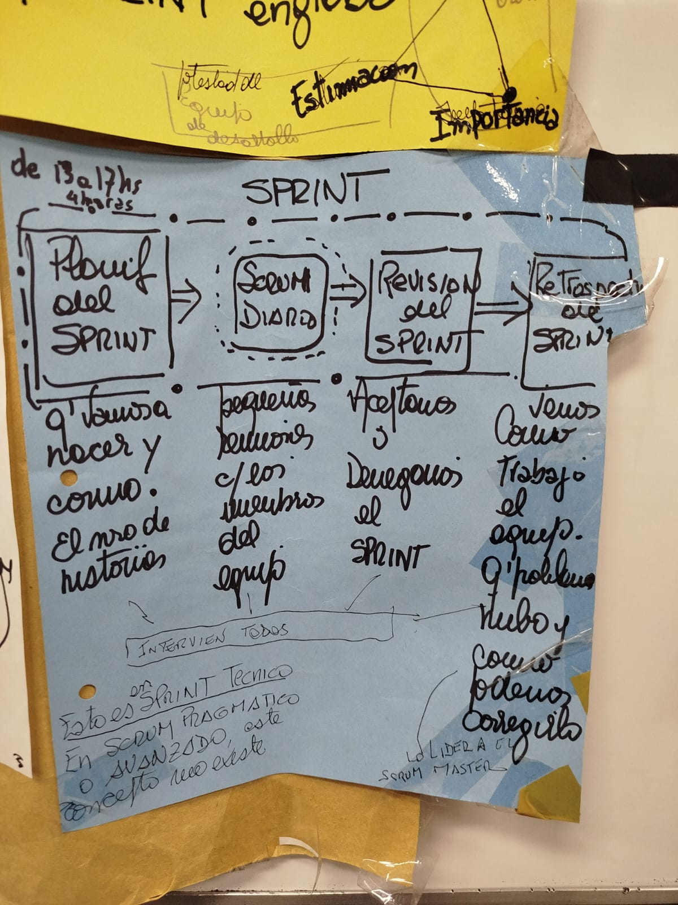
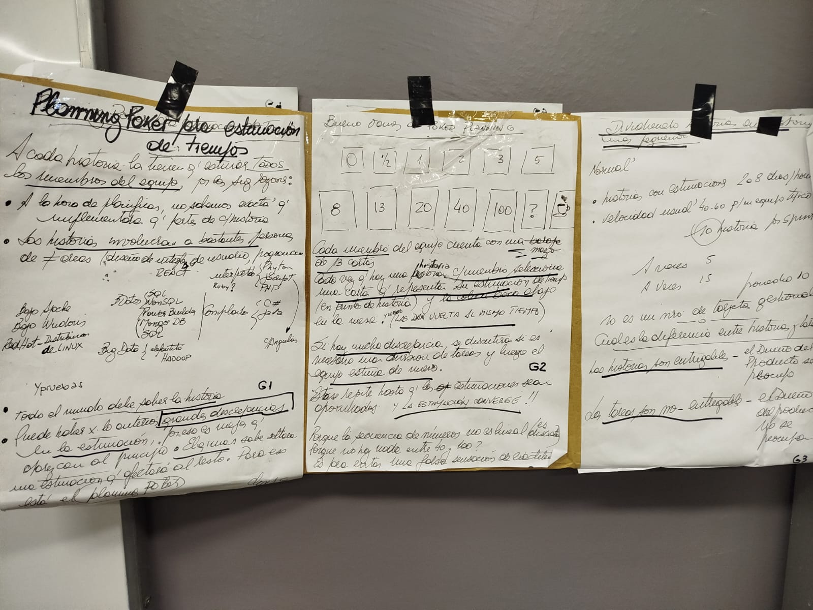

# HTML 5 vs 4 -> 
Soporte multimedia nativo con el uso de tags. Ampliación de la estructura base interpretable con etiquetas adicionales como article, nav, footer que antes eran divs con id.

# APIs de HTML 5 -> 
Son interfaces pre-armadas de Javascript que el desarrollador puede hacer uso para obtener funciones estándar como Geolocation, webstorage, canvas

- Geolocation -> El modelo se compone de objetos como coordinates, position, positionError, positionOptions. Métodos como clearWatch() para deshacer watchPosition() que mantiene handlers de la posición del objeto y getCurrentPosition()
- Canvas -> Permite dibujar elementos en la pantalla e interactuar rotando, transformando, manipulando de alguna manera los elementos. beginPath() moveTo() lineTo() stroke() para hacer el "commit" de la figura
- Webstorage -> permite acceso a almacenamiento de sesión o local. clear(), setItem(), getItem()

# Preguntas criptografía y seguridad

## ¿A quién se considera el padre de la criptografía moderna?
A Claude Shannon, quien sentó las bases teóricas mediante la teoría de la información.

## Confidencialidad vs autenticación. Autenticación refiere a dos clases principales, ¿cuáles son?
La confidencialidad garantiza que la información solo pueda ser leída por quienes están autorizados. Se logra mediante técnicas de cifrado para evitar accesos no autorizados.
La autenticación asegura que la identidad de una entidad o el origen de los datos sea válido. Se divide en:
Autenticación de entidades (verifica quién es el emisor)
Autenticación de origen de datos (verifica que el mensaje proviene de quien dice enviarlo y no fue alterado)

## Las funciones de hashing, posibilitan varias operaciones, describa algunas
Las funciones de hashing permiten:
Verificación de integridad de los datos
Autenticación de origen de datos
Almacenamiento seguro de contraseñas
Generación de firmas digitales
No proporcionan confidencialidad directamente, pero sí son fundamentales en mecanismos de seguridad.

## Cuáles son las teorías relacionadas con la criptografía
Teoría de la información (Claude Shannon): estudia cómo medir, almacenar y transmitir información; introduce conceptos como entropía e incertidumbre.
Teoría de números (Carl Friedrich Gauss): se centra en propiedades de los números enteros, especialmente primos y congruencias, base de muchos algoritmos criptográficos.
Teoría de la complejidad algorítmica: analiza la eficiencia de los algoritmos y permite distinguir problemas fáciles de resolver de los que son computacionalmente difíciles (base de la seguridad criptográfica).

## A las 2 técnicas para disimular información se las llama confusión y difusión
Confusión: disminución de las relaciones entre texto plano y el texto final cifrado para frustrar los intentos de buscar patrones. También se lo conoce como sustitución
Difusión: También se la conoce como transposición. Cambia el orden del texto plano en el texto cifrado cuando se realiza el cifrado

## ¿A qué se le conoce como problemas computacionalmente tratables, e intratables?
Los problemas tratables son aquellos que pueden resolverse en tiempo razonable (complejidad polinómica).
Los problemas intratables requieren tiempos excesivos (generalmente exponenciales), por lo que no son viables en la práctica. La criptografía se basa en este tipo de problemas para garantizar seguridad.

## Escriba lo que sepa de complejidad y a través de qué variables se mide esta
La complejidad algorítmica mide la eficiencia de un algoritmo en función del tamaño de la entrada (n).
Se mide principalmente a través de dos variables:
Tiempo de ejecución (complejidad temporal): cuánto tarda el algoritmo en resolverse.
Espacio o memoria (complejidad espacial): cuánta memoria utiliza durante su ejecución.
Generalmente se expresa usando notación Big-O, que describe cómo crecen estos valores a medida que aumenta n.

## Hay 2 ecuaciones que constituyen la base de la teoría de la información. Explique en detalle qué cosas representan
Ecuación de Entropía: representa la cantidad de información o el grado de incertidumbre de una fuente.
Ecuación de capacidad del canal: indica la máxima cantidad de información que puede transmitirse de manera confiable por un canal de comunicación.
La idea clave es que, para transmitir información sin errores, la cantidad de información generada (entropía) no debe superar la capacidad del canal.

## Nombre los aspectos matemáticos relacionados con el tema de encriptación
Congruencia de Gauss, algoritmo de Euclides extendido (MCD (a,b) = aX + bY), Función de Euler 

## En la fórmula de la clave privada, interviene el MCD, la función de Euler, y el concepto de congruencia. Explique con sus palabras las 2 primeras y ejemplifique la última
MCD es el mayor número que divide a dos números sin dejar resto; se usa para verificar coprimalidad. 
La función de Euler indica cuántos números menores que n son coprimos con n. 
Ejemplo de congruencia
17 ≡ 5 (mod 12), ambos dejan el mismo resto al dividir por 12.

## ¿Cuál es el gran secreto de la encriptación asimétrica?
El gran secreto es que utiliza un par de claves: una pública y una privada, matemáticamente relacionadas. La clave pública puede ser conocida por cualquiera, pero la privada se mantiene en secreto. La seguridad del sistema se basa en que es computacionalmente inviable obtener la clave privada a partir de la pública, debido a la dificultad de los problemas matemáticos en los que se fundamenta.

# Big Data, IoT
## 1. Arquitectura de Big Data
- **Componentes básicos:** La arquitectura contempla las **Fuentes de Big Data** (de donde provienen los datos), los **Tipos de Datos** (su nivel de estructuración) y los **Almacenes de Datos Empresariales (EDW, Enterprise Data Warehouse)**.
- **Flujo de origen:** Los datos ingresan desde la web, redes sociales, interconexión de objetos máquina a máquina (M2M), sensores, biometría y los generados directamente por las personas.

## 2. Características de Big Data
Se definen mediante el modelo de **"Las 3 V de Big Data"**:
- **Volumen:** Hace referencia a la escala de los datos. Involucra Terabytes, registros, transacciones, tablas y archivos.
- **Velocidad:** Hace referencia al ritmo con el que se reciben y procesan. Involucra flujos de datos por lotes, tiempo próximo y tiempo real.
- **Variedad:** Hace referencia a la diversidad de formatos. Abarca datos estructurados, no estructurados, semiestructurados y combinaciones de estos.

## 3. Fuentes de Datos Voluminosos
El documento lista múltiples fuentes de gran volumen, de las cuales podés priorizar estas tres para el examen:
1. **Datos de la Web y Medios Sociales:** Flujos de clics, publicaciones y contenidos de redes.
2. **Datos de Internet de las Cosas (IoT) y M2M:** Interconexión entre máquinas y lecturas de sensores industriales.
3. **Datos de Redes de Telecomunicaciones y Telefonía Móvil:** Registros de llamadas, mensajes, posicionamiento y tráficos multimedia de smartphones.

## 4. Chips NFC y RFID
- **RFID (Identificación por Radiofrecuencia):** Es un sistema de almacenamiento y recuperación de datos remotos. Permite leer y escribir información **sin contacto físico** mediante ondas de radio y antenas. Utiliza etiquetas (_tags_) en objetos (ropa, alimentos, libros) que responden enviando sus datos a un lector dentro de su rango. Se aplica en logística, inventario automático, control de robos y accesos.
- **NFC (Near Field Communication):** Es una **variante de la tecnología RFID**. Es un sistema inalámbrico diseñado para el intercambio de datos a **corta distancia (menos de 10 centímetros)** de forma muy sencilla. A diferencia de RFID en general, **no está dirigida a la transferencia masiva de datos**.

## 5. Código QR y el otro? (Código Bidi)
El documento compara el estándar QR con los **Códigos Bidi**:
- **Código QR (Quick Response Code):** Es un sistema bidimensional para almacenar información en una matriz de puntos, reconocible por sus tres cuadrados en las esquinas. Es un **estándar internacional (ISO/IEC 18004), de código abierto y de libre uso (gratuito)**.
- **Código Bidi:** Funciona bajo los mismos fundamentos teóricos que el QR, pero es de **código cerrado y privado**. Tiene una orientación puramente comercial y un fin lucrativo, por lo que **no es gratuito**.

## 6. Tipos de Big Data
Se clasifican en cinco grandes categorías según su procedencia:
- **I. Web y Medios Sociales:** Feeds de Twitter, entradas de Facebook, contenido web y flujos de clics.
- **II. Máquina a Máquina (M2M / Internet de las Cosas - IoT):** Señales GPS, lecturas RFID y medidores inteligentes.
- **III. Transacciones de Grandes Datos:** Registros de facturación, detalles de llamadas de telecomunicaciones y demandas de salud.
- **IV. Biometría:** Reconocimiento facial y genética.
- **V. Generado por los Humanos:** Correos electrónicos, registros de voz en centros de llamadas y registros médicos electrónicos.

## 7. Importancia de Datos en la Web
- La analítica web es crucial porque estudia el tráfico de un sitio y proporciona **Métricas e Indicadores Clave de Rendimiento (KPI)**.
- Estos indicadores aportan un valor añadido clave para el proceso de **toma de decisiones** en el negocio.
- Permite examinar las rutas y preferencias de compras en e-commerce, identificar qué buscadores y términos de búsqueda usan los usuarios, y evaluar si llegan mediante enlaces gratuitos o publicidad pagada (SEM).

## 8. Análisis de Sentimientos
- Es una rama específica dentro de la **minería de textos** y la minería de datos.
- Se centra en el **análisis de los sentimientos y opiniones** expresados por los usuarios en mensajes de texto y otros formatos de medios.
- Su objetivo principal es **descubrir la opinión o el sentimiento** (positivo/negativo/neutral) oculto en los datos textuales.

## 9. Datos de Sensores, Posición y Geolocalización
- **Sensores:** Son piezas clave en el IoT. Gracias a la miniaturización y redes inalámbricas, monitorean el entorno de forma autónoma, creando "ambientes inteligentes" y vigilando maquinaria (como motores de avión o trenes) en tiempo real.
- **Geolocalización (Posición y Tiempo):** Datos provistos por GPS y smartphones, fundamentales para la **logística**. Permiten ver ubicaciones actuales, trazar rutas históricas o en tiempo real y enviar alertas de proximidad. El documento advierte que estas aplicaciones conllevan **grandes riesgos de privacidad**.

## 10. Cloud Computing (IaaS, PaaS, SaaS) y Perfiles de Usuario
El modelo se define como un sistema de **pago por uso** con acceso bajo demanda a recursos configurables. Según el nivel de control técnico que describe el texto, se identifican los siguientes perfiles:
- **SaaS (Software como Servicio):** El proveedor da aplicaciones listas que corren en la nube y se acceden por navegador (ej. Gmail). El usuario no tiene ningún control sobre la infraestructura ni la aplicación.
- **PaaS (Plataforma como Servicio):** Permite al usuario desplegar aplicaciones propias desarrolladas por él usando las herramientas y lenguajes del proveedor. No administra redes ni servidores, pero tiene el control total de sus aplicaciones alojadas.
- **IaaS (Infraestructura como Servicio):** El proveedor ofrece almacenamiento, procesamiento y redes raw. El usuario no controla la infraestructura física fundamental, pero tiene control total sobre los sistemas operativos, el almacenamiento y las aplicaciones desplegadas.

## 11. Modelos de Despliegue de la Nube
El documento señala que según el NIST existen cuatro modelos, detallando textualmente los siguientes:
- **Nube Privada:** La infraestructura se gestiona y provee de forma **exclusiva para una única organización**.
- **Nube Pública:** Es operada por un proveedor que ofrece los servicios al **público en general** (puede ser propiedad de una empresa, gobierno o entidad académica).
- **Nube Híbrida:** Es la **combinación de dos o más nubes** individuales (públicas, privadas o comunitarias) que se mantienen como entidades únicas pero permiten la portabilidad de datos y aplicaciones entre sí.
- _(Nota: En los gráficos del texto se incluye también la **Nube Comunitaria** como el cuarto modelo visualizado)_.

## 12. IoT (Internet de las Cosas)
- Se refiere a la **interconexión de objetos y la comunicación máquina a máquina (M2M)**.
- Se sustenta principalmente en el uso de **sensores integrados o embebidos** en dispositivos, vehículos y maquinarias, permitiendo recolectar datos del entorno de manera ubicua y autónoma en tiempo real.

## 13. Tipos de Datos (Estructurados, No Estructurados)
El documento clasifica los datos en tres grandes categorías:
- **Estructurados:** Son los datos tradicionales almacenados en **bases de datos relacionales**.
- **No Estructurados:** Datos sin un formato nativo rígido, tales como **audio, video, fotografías y textos**.
- **Semiestructurados:** Datos que no están en tablas pero contienen etiquetas organizativas, como los archivos **HTML y XML**.

## 14. Preguntas sobre Hadoop
- **¿Qué es?** Apache Hadoop es una biblioteca de software de **código abierto** que soporta el **procesamiento distribuido** de grandes conjuntos de datos a través de miles de computadoras ordinarias. Nació de la mano de Google y Yahoo.
- **¿Cuáles son sus componentes principales?** Consta de tres: **HDFS** (Hadoop Distributed File System), **MapReduce** y **Hadoop Common**.
- **¿Cómo funciona su arquitectura?** Está diseñado para correr en un gran número de máquinas que **no comparten memoria ni discos**. El software divide los datos en piezas, los despliega en diferentes servidores del clúster (_rack_) y realiza de forma automática **múltiples copias (redundancia)**.
- **¿Qué hace su núcleo (MapReduce)?** Resuelve los fallos hardware automáticamente. Si un servidor falla, MapReduce ejecuta las porciones del programa en otro servidor del clúster donde los datos estén replicados.

## 15. KPIs (Indicadores Clave de Rendimiento)
- Son **métricas específicas** adaptadas a la naturaleza de un modelo de negocio. El texto aclara una regla importante: **"Todos los KPI son métricas, pero no todas las métricas son KPI"**.
- **Ejemplos en Comercio Electrónico:** Tasa de abandono, tasa de conversión, tiempo de permanencia en el sitio y páginas visitadas.
- **Ejemplos en Tienda Tradicional:** Valores de venta por hora, promedio de venta por cliente y artículos por venta.

## 16. Crowdsourcing
- El documento lo define textualmente como una forma de **financiación en masa** apoyada en una red de cooperación colectiva de personas para conseguir dinero. Ayuda a la creación de nuevas empresas.
- Menciona que el **Crowdfunding** es una variante de este, y clasifica sus tipos en: **Donación, Recompensa, Pre-compra y Equidad** (_Equity_).

# XML
El espacio de nombres `System.Xml` se divide fundamentalmente en **tres formas de trabajar con XML**, dependiendo de si necesitás velocidad, edición o consultas avanzadas:

## 1. El Enfoque de Flujos (Streaming)
Es un modelo de "cursor hacia adelante" (forward-only). No carga todo el documento en memoria, lo que lo hace ultra rápido para archivos gigantes.
- **Para Leer (`XmlReader`):** Lee línea por línea. `XmlTextReader` lee desde archivos de manera directa, mientras que `XmlValidatingReader` añade una capa para verificar que el XML cumpla con las reglas (DTD o Esquemas).
- **Para Escribir (`XmlWriter` / `XmlTextWriter`):** Escribe XML de forma secuencial, controlando de forma estricta la apertura y cierre de etiquetas mediante métodos (`WriteStartElement`, `WriteEndElement`). 

## 2. El Enfoque DOM (Document Object Model)
Carga todo el XML en la memoria RAM y genera una estructura de árbol de nodos interconectados (`XmlNode`).
- **`XmlDocument`:** Te permite moverte en cualquier dirección (padres, hijos, hermanos) y, lo más importante, **permite modificar y guardar el XML**. Su contra es que consume mucha memoria.
- **`XmlDataDocument`:** Una genialidad de la época de .NET 2.0 que permitía mapear ese árbol XML directamente con un `DataSet` (tablas relacionales) de base de datos.

## 3. El Enfoque de Consultas y Transformaciones (XPath/XSLT)
Diseñado específicamente para buscar datos sin recorrer el árbol a mano y para cambiar el formato del archivo.
- **`XPathDocument`:** Es una caché en memoria de **solo lectura**. Está ultra optimizada para que las consultas XPath sean un rayo.
- **`XPathNavigator`:** Es el cursor que se mueve por el `XPathDocument` (o `XmlDocument`) para ejecutar las búsquedas mediante el método `.Select()`.
- **`XslTransform`:** Agarra el XML, le aplica una plantilla de diseño (XSLT) y te escupe un archivo transformado que puede ser un **HTML, un texto plano o un nuevo XML**.

# Scrum
Puede entrar en el parcial:
- Explicar el grafico de burndown
- Roles
- Ciclo de sprint
- Planning poker

## Ciclo del sprint
El ciclo del sprint está compuesto por varias reuniones donde intervienen todos los del equipo:
- Sprint planning: Se deice que vamos a hacer y como. El numero de historias de usuario a realizar.
- Scrum diario o daily: Pequeñas reuniones donde se dice el estado de la historia de usuario. 
- Revisión del sprint: Se muestra lo trabajado durante el sprint a los clientes o interesados para recibir feedback y validar lo que se construyó.
- Retrospectiva del sprint: Se ve como trabajo el equipo y que se puede mejorar.

## Roles
Los principales roles del scrum son:
1. Product owner: Persona que está en contacto directo con el cliente y es interlocutor con todos los stakeholders. También debe mantener el backlog detallado.
2. Scrum master: Es el responsable de que la metodolgía sea comprendida y aplicada en la mesa y facilitador en las reuniones
3. Equipo de desarrollo: Equipo encargado de realizar las tareas, debe ser autoorganizado y tienen responsabilidad compartida de terminar el trabajo
4. Stakeholders: Personas que no tienen un rol formal pero que su opinion debe ser tomada en cuenta, expertos, asesores.

## Grafico
Sirve para mostrar claramente cuánto trabajo falta por hacer frente al tiempo que queda para terminar el sprint

### Sus componentes principales
- Eje Vertical (Y): Representa el trabajo pendiente. Por lo general, se mide en Story Points (Puntos de historia) o en horas de trabajo.
- Eje Horizontal (X): Representa el tiempo. En el caso de un sprint, son los días de duración del mismo (por ejemplo, del día 1 al día 14).
- La Línea Ideal (o planificada): Es una línea recta en diagonal que empieza en la parte más alta (el total de trabajo comprometido en la Sprint Planning) y termina en cero el último día del sprint. Es el "ritmo perfecto" al que el equipo debería avanzar.
- La Línea Real: Es la línea que el equipo va actualizando día a día, generalmente durante la Daily Scrum. Refleja el trabajo que realmente queda por completar.

## Planning poker
El Planning Poker es una técnica de estimación para calcular el esfuerzo, la complejidad o el tamaño de las historias de usuario a forma de juego.

Por lo general, esta dinámica se realiza durante la reunión de Sprint Planning o en sesiones previas de refinamiento del Backlog.

### ¿Por qué es tan útil?
Evita el "efecto ancla": Al votar en secreto y revelar al mismo tiempo, se evita que la opinión de la primera persona en hablar (o la del miembro con más experiencia) influya en lo que piensan los demás.

Fomenta la comunicación: Obliga al equipo a hablar sobre cómo van a resolver el problema, sacando a la luz dudas técnicas antes de empezar a programar.

Hace partícipe a todo el equipo: Todos los miembros tienen voz y voto en el proceso de planificación.

